 

  

## 👋 About Me

Hi, I'm **Andrino** — an **Informatics Engineering student** who enjoys turning ideas into practical digital solutions.

I'm interested in **software development, artificial intelligence, information systems, and data-driven applications**.

> **Build with purpose • Learn continuously • Improve every day**

### 🔎 What I Like Building

- 💻 Web Applications
- 📱 Mobile Applications
- 🤖 AI-powered Systems
- 🧠 Machine Learning Solutions
- 🔎 NLP & Information Retrieval
- 📚 RAG-based Applications
- 🗄️ Information Systems
- ⚙️ Automation & Digital Solutions

## 🧰 Tech Stack

### 💻 Languages

  

### 🌐 Web & Mobile

  

### 🤖 AI & Data

  
  
  
  
  

### 🗄️ Database & Tools

  

## 🚀 Featured Projects

<table>
<tr>

<td width="50%" valign="top">

<h3>🛠️ SIGAP ICT</h3>

<strong>Web-based IT Helpdesk System</strong>

A digital helpdesk platform designed to organize ICT complaints,
technical assistance, and engineer escalation.

<strong>Core Features</strong>

- 📌 ICT complaint management
- 🗂️ Complaint categorization
- 💡 Self-service troubleshooting
- 🛠️ Technical assistance
- 📲 Engineer escalation
- 📋 Structured complaint flow

<code>HTML</code>
<code>CSS</code>
<code>JavaScript</code>
<code>Flask</code>

</td>

<td width="50%" valign="top">

<h3>🦺 SIGAP HSE</h3>

<strong>Digital HSE Solution</strong>

A digital solution focused on workplace safety information,
risk awareness, and knowledge management.

<strong>Core Features</strong>

- ⚠️ Risk identification
- 🦺 HSE information
- 📚 Knowledge management
- 🔎 Information retrieval
- 📝 Digital reporting
- 🤖 AI-assisted solutions

<code>Python</code>
<code>AI</code>
<code>Web</code>
<code>HSE</code>

</td>

</tr>

<tr>

<td width="50%" valign="top">

<h3>🤖 RESEARCH_ASSISTANT_AI</h3>

<strong>AI Research Assistant</strong>

An AI-powered assistant designed to support research,
information retrieval, and academic workflows.

<strong>Core Features</strong>

- 🔎 Information retrieval
- 🧠 NLP processing
- 🤖 LLM integration
- 📚 Research assistance
- 🔗 AI workflows
- 🧩 LangGraph workflow

<code>Python</code>
<code>LangChain</code>
<code>LangGraph</code>
<code>Gemma</code>

</td>

<td width="50%" valign="top">

<h3>🏥 SMART QUEUE SYSTEM</h3>

<strong>Clinic Queue Management System</strong>

A web-based system for organizing patient registration
and clinic service queues.

<strong>Core Features</strong>

- 🧾 Patient registration
- 🎫 Queue management
- 📋 Queue monitoring
- 🏥 Clinic service organization
- ⚡ Efficient service flow
- 🖥️ Web-based management

<code>PHP</code>
<code>MySQL</code>
<code>HTML</code>
<code>CSS</code>

</td>

</tr>
</table>

## 💭 A Little Motivation

  

> “The man who moves a mountain begins by carrying away small stones.”
>
> — Confucius, *The Analects*

Every big achievement starts with small steps.

Keep learning.  
Keep building.  
Keep improving.

**One line of code. One problem solved. One step forward.**

  <i>“Build quietly. Improve constantly. Let the results speak.”</i>

  <a href="https://www.goodreads.com/work/quotes/3320969">
    Read more inspiring quotes
  </a>

